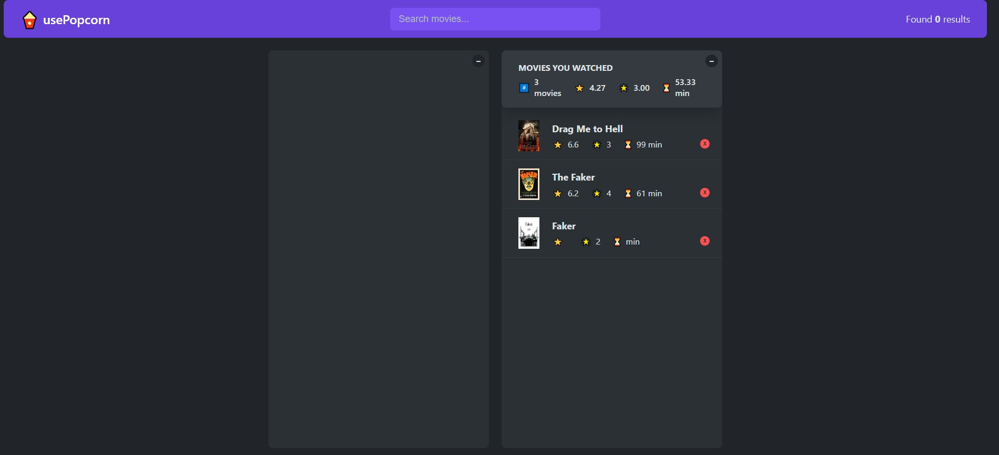
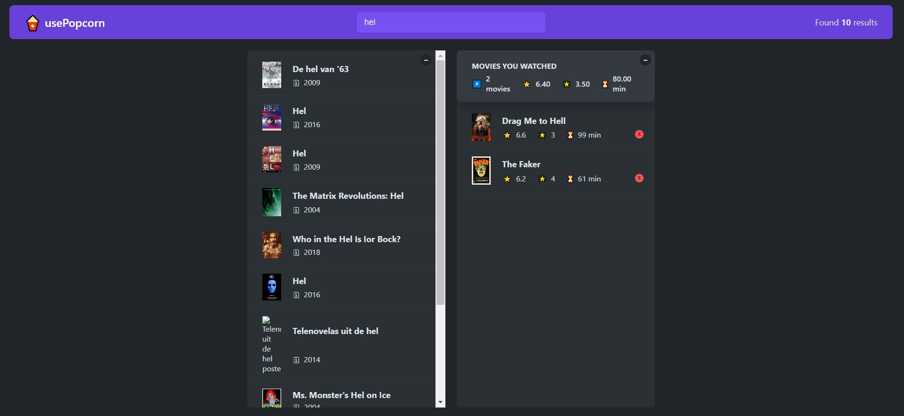
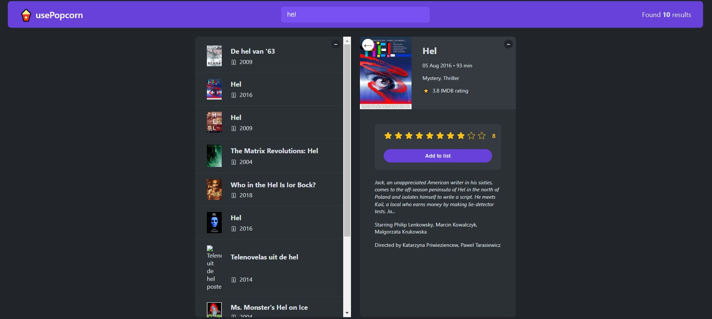

<div align="center">

</div>

<div align="center">
    <h1 align='center'>⚡️<i>usePopcorn</i>⚡️</h1>
    <p> A movie website </p>
</div>

<h2 style="display:inline">📝 Table of Contents</h2>

- 📑 About
- ⛏️ Built With
- 🏁 Getting started
- ✍️ Contributors

---

## 📑 About

- This project views the movies list you search for. Throught the API: http://www.omdbapi.com/

- In this project you can also rate a movie and add it to the watched list

- I apply the pure concepts of React in this project like using states and effect, also create custom hooks to handle the requests and manipulating the dom, too.

---

## Features

<ul>
    <li>Search for movies
</li>
    <li>Rate a movie and add it to the watched list
</li>
    <li>Saving the watched list in the browser.
</li>
</ul>

---

## ⛏️ Built With

- <h3> <a href="https://react.dev/blog/2022/03/29/react-v18" target="_blank">pure React18</a></h3>

---

## 🏁 Getting started

### Clone the repository

```bash
$ git@github.com:ahmedasad236/usePopcorn.git
```

### Install the required dependencies

```bash
$ npm install
```

### Run the application

```bash
$ npm start
```

---

## Usecases

- 
- 
- 

## ✍️ Contributors

<table>
  <tr>

<td align="center">
<a href="https://github.com/ahmedasad236" target="_black">
<br /><sub><b>Ahmed Asaad</b></sub></a><br />
</td>

</tr>
 </table>

---

## Credits

This project was developed by <a href="https://github.com/ahmedasad236" target="_black">
Ahmed Asaad</a> during The React course of Mr.Jonas Shmedtman
